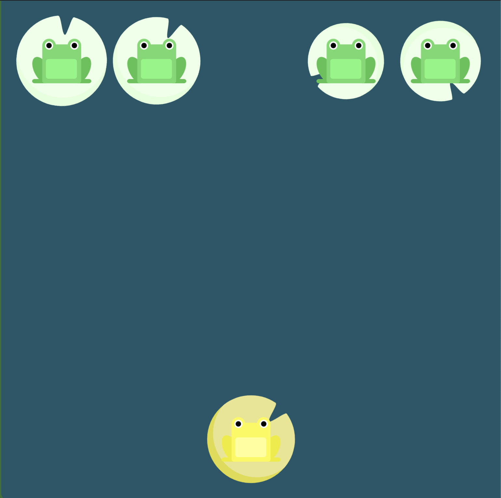
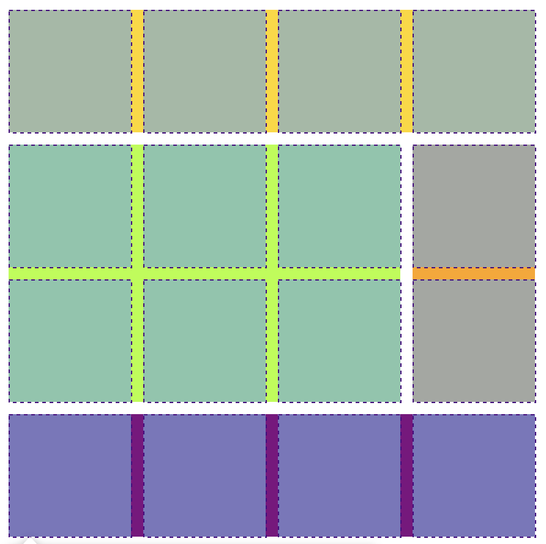
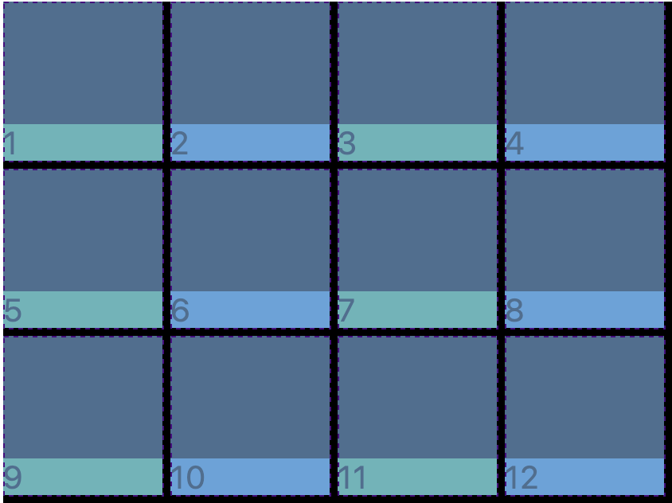
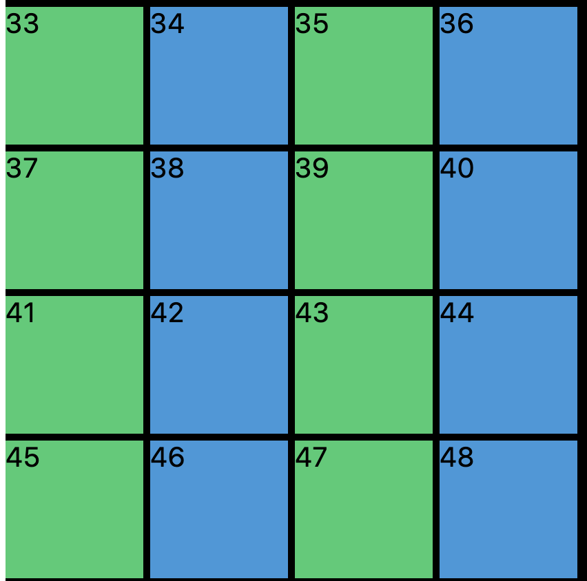
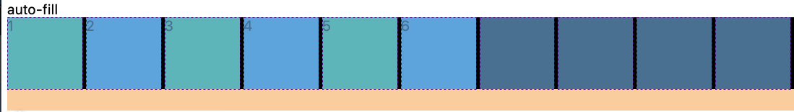
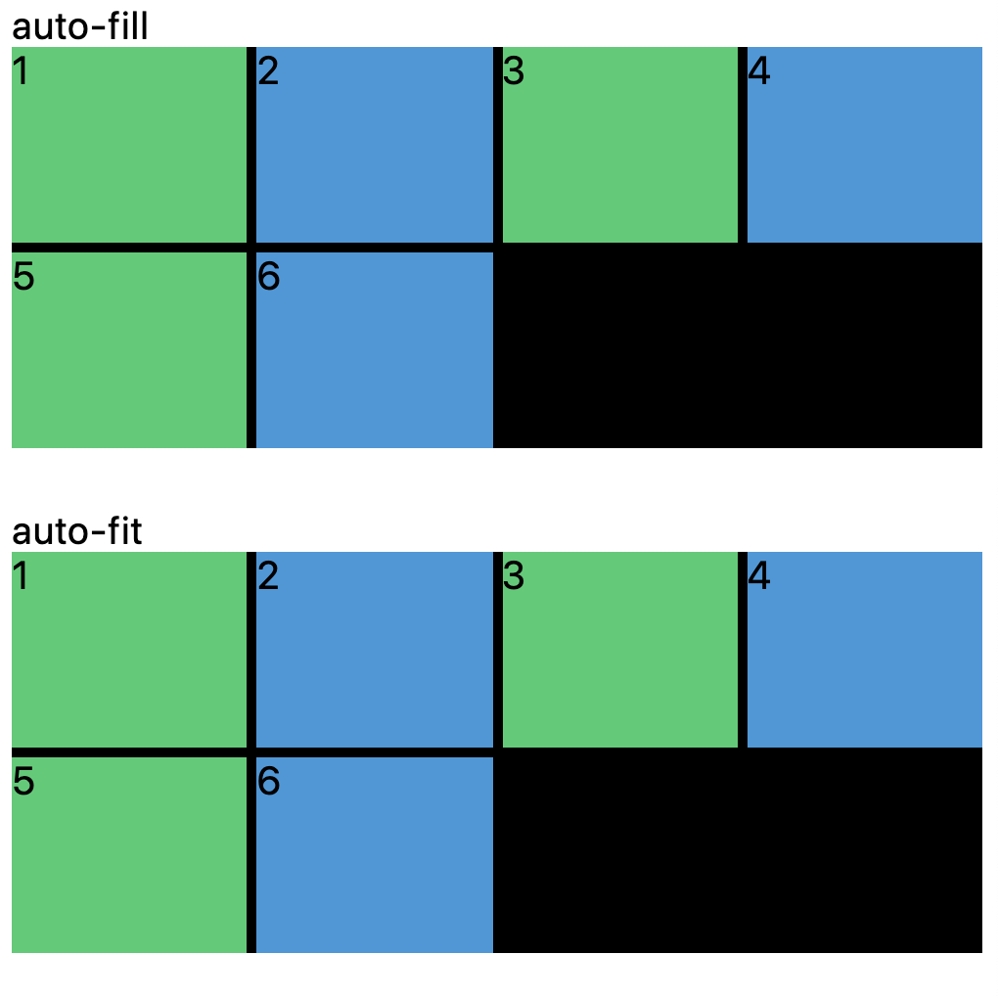

# CSS/SCSS Layout: Flexbox & Grid

### Tip

- Just inspect element whenever problem arose
- Put cursor on the top of CSS class names, instead of memorizing stuffs

### Studying Tip

- CSS flex box appeared in context of solving manual positioning of boxes
- It's important to understand what problem that the technology has solved, instead of just learning stuff what other people think is valuable.

## Flexbox

### [🐸 Practice at flexboxfroggy! 🐸](https://flexboxfroggy.com/)

- Only talk to the flexbox container outside, don't talk to the children. 
- Direct father controls the positioning of the children content
  ex) .wrapper is father of .box

### [Flex-direction and axis](https://developer.mozilla.org/en-US/docs/Web/CSS/CSS_Flexible_Box_Layout/Ordering_Flex_Items)

```css
.father {
	display:flex 
}
```

display flex sets default flex-direction as row

### **When flex-direction is row,**

```css
.father {
	display:flex;
  flex-direction: row;
}
```


- Main axis is x-axis
  - justify-content move childrens on main axis (= justify-content modify lines of main axis)


- Cross axis is y-axis
  - align-items move children on cross axis (= align-items modify lines of cross axis)

### **When flex-direction is column,**

```css
.father {
	display:flex;
  flex-direction: column;
}
```


- Main axis is y-axis
  - justify-content move childrens on main axis (= justify-content modify lines of main axis)


- Cross axis is x-axis
  - align-items move children on cross axis (= align-items modify lines of cross axis)
  
- justify-content & align-items can be used in any elements: it affects subordinated children elements. 

### When flex-direction is row-reverse ( or column reverse)

```css
.father {
	display:flex;
  flex-direction: row-reverse;
 	/*flex-direction: column-reverse;*/
}
```

- Axis layout is the same. 
- Only left-to-right sequential arraying is reversed as right-to-left.

### [align-self](https://developer.mozilla.org/en-US/docs/Web/CSS/align-self)

```css
.father {
	display:flex;
  flex-direction: flex-start;
}

.yellow{
  align-self: flex-end;
}
```

- Overrides father flexbox's align-items
- Child element will move along cross axis



### align-content

```css
.father {
  display:flex;
  flex-wrap: wrap;
  align-content: space-between
}
```

- **aligning lines (of frogs)** along cross axis


### order

```css
/* right */
.child {
  background: peru;
  order: 1;
}

/* left */
.child:nth-child(2) {
  order: -1;
}

/* middle */
.child:nth-child(3) {
  order: 0;
}
```

- flexbox order is **sequentially assigning children itself** along main axis of father flexbox.
- default is 0
- comparing orders like 0<1 or -1<0 will shift the elements along the main axis of father flexbox.

### [flex-wrap](https://developer.mozilla.org/en-US/docs/Web/CSS/flex-wrap)

```css
.father {
  flex-wrap: wrap
}
```

- wrap means keep the size of the children, when window ran out of spaces
- wrap also means to make multiple lines along father flexbox's main axis
- flex-wrap: wrap-reverse; is reverse direction of main axis
- default value is nowrap
- nowrap means cram everyting in one father (line), even if sizes of children are shrunk

### flex-shrink

```css
.father {
	flex-wrap: nowrap;
}

.child{
  flex-shrink: 2;
}
```

- enabled only when father doesn't respect the size of children
- kicks in when window ran out of spaces, along the main-axis
- default value is 1
- flex-shrink value 2 means it is 200% more likely to shrink than the other children

### flex-grow

```css
.child{
  flex-grow: 1;
}

.child:nth-child(2) {
  flex-grow: 2;
}

.child:nth-child(3) {
  flex-grow: 1;
}
```

- enabled regardless of flex-wrap.
- flex-grow takes the space that is available to grow in the window, along the main-axis

- default value is 0, which means that child will keep its size, doesn't take space that is available to grow
- flex-grow value 1 and 2 is proportional to each other: it grows twice more than the other children

### [flex-basis](https://developer.mozilla.org/en-US/docs/Web/CSS/flex-basis)

```css
.father {
  display: flex;
  flex-direction: row;
  width: 100wh;
}

.child {
  flex-basis: 30%;
  /* flex-basis: 100px; */
}
```

- Sizing element along the main-axis of the father flexbox
- flex-basis % is percentage of size of father flexbox
  ex: if father flexbox width is 100wh and if child's flex-basis is 30%, then size of the child will be 30wh
- You can also give fixed pixel values to the child box


## Grid

## [🌱 Practice at Grid Garden 🌱](https://cssgridgarden.com/)

```css
.father {
  display: grid;
}
```

- Flex is only columns: one dimensional layout.
- Grid is two dimensional: you can create  table-like  grid layout
- usually talking to father, not to children

### [grid-template-columns, grid-template-rows](https://developer.mozilla.org/en-US/docs/Web/CSS/grid-template)

### grid column-gap, grid row-gap

```css
.grid{
	display: grid;
  grid-template-columns: 250px 250px 250px;
  grid-template-rows: 100px 50px 300px;
  column-gap: 5px;
  row-gap: 10px;
}
```

- gap between grids are written as column-gap, row-gap
- writing "gap" standalone is for both column-gap and row-gap

### grid-template-areas 

```css
.grid {
  display: grid;
  grid-template-columns: repeat(4, 200px);
  grid-template-rows: 100px repeat(2, 200px) 100px;
  grid-template-areas:
    /* row names and aligning */
    "header header header header"
    "content content . nav"
    "content content . nav"
    "footer footer footer footer";
}

.header {
  background-color: gold;
  grid-area: header;
}

.content {
  background-color: greenyellow;
  grid-area: content;
}

.nav {
  background-color: orange;
  grid-area: nav;
}

.footer {
  background-color: purple;
  grid-area: footer;
}
```

- Matching grid-area value to grid-template-areas value in father. NOT BY CLASS NAMES!

### grid-column and grid-row

```css
.grid {
  display: grid;
  gap: 10px;
  grid-template-columns: repeat(4, 100px);
  grid-template-rows: repeat(4, 100px);
}

.header {
  background-color: gold;
  /* grid-column-start: 1;
  grid-column-end: 5;*/ 
  
  /* grid-column: 1 / 5; */
	
  grid-column: 1 / -1;
}

.content {
  background-color: greenyellow;
  /*grid-column-start: 1;
  grid-column-end: 4;
  grid-row-start: 2;
  grid-row-end: 4;*/
  
  /* grid-column: 1 / 4;
  grid-row: 2 / 4; */
  
  grid-column: 1 / -2;
  grid-row: 2 / span 2;
}

.nav {
  background-color: orange;
	/* grid-row-start: 2;
  grid-row-end: 4; */

  /* grid-row: 2 / 4; */
  
  grid-row: 2 / span 2;
}

.footer {
  background-color: purple;
  /* grid-column-start: 1;
  grid-column-end: 5; */
  
  /* grid-column: 1 / 5; */
  
  grid-column: span 4;
}
```



**Nominating & Stretching with # starting line and # end line**

- stretching elements from start (#white-line-number) to end (#white-line-number)
- abbreviaiton with (starting line) / (end line)
- you can count lines from beginning as 1, 2, 3 ...
  - left border line is 1: start line
- you can count from the end as -1, -2, -3 ...
  - right border line is -1: end line

**Stretching with numbers of cells**

- stretching elements with span (space numbers)
- you can mix with starting line and end line


### **fr(fraction)**

```css
.grid {
  display: grid;
  width: 500px;
  height: 50vh;
  grid-template-columns: 1fr, 1fr, 1fr, 1fr
}
```

- **Takes in from the size of the grid itself: width and height**
- Sizing columns as 100 px will be too big on phone
- **fr and % are both proportional to window size**

### grid-template and fr

```css
.grid {
  display: grid;
  gap: 10px;
  width: 100wh;
  height: 100vh;
  grid-template:
    /* naming each of cells */
    "header header header header" 1fr /* 1fr is how tall the cells are */
    "content content content nav" 2fr 
    "footer footer footer footer" 1fr / 1fr 1fr 1fr 1fr; 
  																		/* width of cells in each 4 rows*/
  																    /* 4 rows: 1fr + 2fr + 1fr */
}

.header {
  background-color: gold;
  grid-area: header;
}

.content {
  background-color: greenyellow;
  grid-area: content;
}

.nav {
  background-color: orange;
  grid-area: nav;
}

.footer {
  background-color: purple;
  grid-area: footer;
}
```


### justify-items & align-items: moving contents within grid



```css
.grid {
  display: grid;
  align-items: end;
  justify-items: stretch;
}
```

- In html, needs to have some contents(like letters) to move items within cell along axis
  - main axis is fixed as x-axis, cross axis is fixed as y-axis
  - justify-content is horizontal, align-items is vertical
- default value is stretch: stretching along the axis

### place-items

```css
.grid {
  display: grid;
  place-items: end stretch;
}
```

- Shortcut for align-items and justify-contents


### justify-content & align-content Moving grids as a whole

```css
.grid {
  background: black;
  display: grid;
  gap: 10px;
  height: 250vh;
  grid-template-columns: repeat(4, 100px);
  grid-template-rows: repeat(4, 100px);
	align-content: end;
  justify-content: space-evenly;
}
```


- Grid container is 100% width, which is black background on the note_img/image
- justify-content and align-content moves **whole grid** within grid container.
- It is different from justify-items and align-items, since 
  -items **only move contents within individual grids.**

### place-content

```css
.grid {
  background: black;
  display: grid;
  gap: 10px;
  height: 250vh;
  grid-template-columns: repeat(4, 100px);
  grid-template-rows: repeat(4, 100px);
  /* align-content: end;
  justify-content: space-evenly; */
  place-content: end space-evenly;
}
```

- shortcut for align-content & justify-content

### align-self,  justify-self, place-self


```css
.item:nth-child(odd) {
  background-color: #2ecc71;
  align-self: end;
  justify-self: center;
  /* place-self: end center */
}
```

- applying only to child grid itself and content within

### grid-auto-rows



```css
.grid {
  background: black;
  display: grid;
  gap: 5px;
  grid-template-columns: repeat(4, 100px);
  /* grid-template-rows: repeat(4, 100px); */
  grid-auto-rows: 100px;
}
```

- You don't know how much rows of grids you should prepare in order to hold data from the server
- if content numbers >>> rows, then disaster!
- So automatically prepare rows

### grid-auto-flow


```css
.grid {
  background: black;
  display: grid;
  gap: 5px;
  grid-template-columns: repeat(4, 100px);
  grid-template-rows: repeat(4, 100px);
  grid-auto-flow: column;
}
```

- whenever more divs in html than prepared in css, you can place overflowed item to row / column direction
  - column is horizontally arraying direction -> gallery of photos
  - row is vertically arraying direction -> usually used

### grid-auto-columns


```css
.grid {
  ...
  grid-auto-flow: column;
  grid-auto-columns: 100px;
}
```

- Used along with grid-auto-flow, keeping size still for overflowed arrayed elements 

### minmax

```css
.grid {
  display: grid;
  grid-template-columns: repeat(10, minmax(100px, 1fr));
```

- setting minimum / maximum size for the grid
- minimum size can be absolute
- maximum size can be both absolute or relative


## Responsive Design

### grid-auto-fill



```css
.grid {
  background: black;
  display: grid;
  gap: 5px;
}

.grid:first-child {
  grid-template-columns: repeat(auto-fill, minmax(100px, 1fr));
}
```

- automatically filling empty spaces with more numbers of grids
- when receiving numbers of elements are undefined, you can use grid-auto-fill

### grid-auto-fit




```css
.grid {
  background: black;
  display: grid;
  gap: 5px;
  /* first picture is grid-auto-rows where two rows are automatically formed */
  grid-auto-rows: 100px; 
}

.grid:last-child {
  grid-template-columns: repeat(auto-fit, minmax(100px, 1fr));
}
```

- automatically stretching grids to the empty spaces in windows

### min-content

```css
.grid {
  display: grid;
  grid-template-columns: repeat(5, minmax(min-content, 1fr));
  grid-auto-rows: 100px;
}
```


### max-content

```css
.grid {
  display: grid;
  grid-template-columns: repeat(auto-fit, minmax(20px, max-content));
  grid-auto-rows: 100px;
}
```


## SCSS

- preprocessor for CSS
- SCSS & Saas is compiled into CSS
- with SCSS, you can make CSS like a programming language

### [Initialize with npm and yarn](https://youtu.be/DT5uy4n28p8?t=349)

```shell
npm init
npm install gulp-cli -g
npm install gulp gulp-sass gulp-csso node-sass gulp-autoprefixer del -D
npx -p touch nodetouch gulpfile.js
```

```shell
yarn init
yarn add @babel/{register,core}
yarn add @babel/preset-env
yarn add gulp gulp-sass gulp-csso node-sass gulp-autoprefixer del -D
```

### [Adding babel to project instruction](https://www.youtube.com/watch?v=pd210a1Tl74&feature=emb_title)

- add script to package.json

```json
"scripts": {
    "dev": "gulp dev"
  },
```

- manually make babelrc file

```javascript
{
  "presets": ["@babel/preset-env"]
}
```

- change (previously created) gulpfile.js -> gulpfile.babel.js

### Testing Environment setup

```shell
gulp dev
yarn dev
```


## Concepts

- [x] flex-direction
- [x] order
- [x] justify-content
- [x] align-items
- [x] align-self
- [x] flex-wrap
- [x] align-content
- [x] flex-grow
- [x] flex-shrink
- [x] flex-basis

## Grid:

- [x] grid-template-columns
- [x] grid-template-rows
- [x] column-gap
- [x] row-gap
- [x] gap
- [x] grid-template-areas
- [x] grid-column-start
- [x] grid-column-end
- [x] grid-row-start
- [x] grid-row-end
- [x] grid-column
- [x] grid-row
- [x] grid-template
- [x] justify-items
- [x] align-items
- [x] place-items
- [x] justify-content
- [x] align-content
- [x] place-content
- [x] justify-self
- [x] align-self
- [x] place-self
- [x] grid-auto-rows
- [x] grid-auto-flow
- [x] grid-auto-columns

### Keywords & Functions:

- [x] repeat
- [x] fr
- [x] minmax
- [x] auto-fit
- [x] auto-fill
- [x] min-content
- [x] max-content

## SCSS:

- [ ] Variables
- [ ] Nesting
- [ ] Mixins
- [ ] Extend
- [ ] Responsive Mixins

## To Clone:

- [ ] [https://besthorrorscenes.com/](https://besthorrorscenes.com/)
- [ ] [https://paint-box.com/](https://paint-box.com/)
- [ ] [http://10x19.co/](http://10x19.co/)
- [ ] [http://www.z-o-o.fr/](http://www.z-o-o.fr/) -> Referencing this website for FitCuration
- [ ] [https://schwartzmedia.com.au/](https://schwartzmedia.com.au/)
- [ ] [https://tolv.dk/](https://tolv.dk/)
- [ ] [https://rodicdavidson.co.uk/](https://rodicdavidson.co.uk/)
- [ ] [https://beige.de/](https://beige.de/)
- [ ] [http://donicaida.com/](http://donicaida.com/)
- [ ] [https://canalstreet.market/](https://canalstreet.market/)
- [ ] [https://wonhundred.com/](https://wonhundred.com/)


## My Questions

- [CSS Units - What is the difference between vh/vw and %?](https://stackoverflow.com/questions/31039979/css-units-what-is-the-difference-between-vh-vw-and)]

