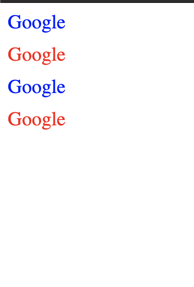

## SCSS

- preprocessor for CSS
- saas is compiles SCSS into CSS
- with SCSS, you can make CSS like a programming language

### [Initialize with npm and yarn](https://youtu.be/DT5uy4n28p8?t=349)

```shell
npm init
npm install gulp-cli -g
npm install gulp gulp-sass gulp-csso node-sass gulp-autoprefixer del -D
npx -p touch nodetouch gulpfile.js
```

```shell
yarn init
yarn add @babel/{register,core}
yarn add @babel/preset-env
yarn add gulp gulp-sass gulp-csso node-sass gulp-autoprefixer del -D
```

### [Adding babel to project instruction](https://www.youtube.com/watch?v=pd210a1Tl74&feature=emb_title)

- add script to package.json

```json
"scripts": {
    "dev": "gulp dev"
  },
```

- manually make .babelrc file

```javascript
{
  "presets": ["@babel/preset-env"]
}
```

- change (previously created) gulpfile.js -> gulpfile.babel.js

```shell
gulp dev
(or yarn dev)
```

- Testing Environment setup like above
- Once running the gulpfile.babel.js, every changes made on styles.scss will be reflected on styles.css, realtime.

### Variables

```scss
/* _variables.scss */
$bg: pink;
```

```scss
/* styles.scss */
@import "_variables";

h2 {
  color: $bg;
}
```

- styles.scss is compiled into styles.css
- _variables.scss is not compiled, only provides variable to styles.scss
- you can import $variables to styles.scss

### Nesting

HTML

```html
<body>
    <h2>Title</h2>
    <div class="box">
      <h2>subtitle</h2>
</div>
```

SCSS

```scss
/* targeting h2 tag */
h2 {
  color: $bg;
}

/* targeting h2 tag under <div class="box"> */
.box {
  h2 {
    color: blue;
  }
}
```

- Targeting specific elements under div class(= "box") elements

SCSS

```scss
.box {
  margin-top: 20px;
  &:hover {
    background-color: green;
  }
}
```

CSS

```css
.box {
  margin-top: 20px;
}
.box:hover {
  background-color: green;
}
```

- Targeting div class(= "box") element parellelly 
  - scss code above is compiled into css code below

### @Mixin



_mixins.scss

```scss
@mixin link($word) {
  text-decoration: none;
  display: block;
  @if $word == "odd" {
    color: blue;
  } @else {
    color: red;
  }
}
```

styles.scss

```css
@import "_mixins";

a {
  margin-bottom: 10px;

  &:nth-child(odd) {
    @include link("odd");
  }

  &:nth-child(even) {
    @include link("even");
  }
}
```

### @Extend

_buttons.scss

```scss
%button {
  font-family: inherit;
  border-radius: 7px;
  font-size: 12px;
  text-transform: uppercase;
  padding: 5px 10px;
  background-color: peru;
  color: white;
  font-weight: 500;
}
```

styles.scss

```scss
@import "_buttons";

a {
  @extend %button;
  text-decoration: none;
}
button {
  @extend %button;
  border: none;
}
```

- Write common design in _<file_name>.scss, extend it to styles.scss
- Import common design from <file_name>, add some customizations.


