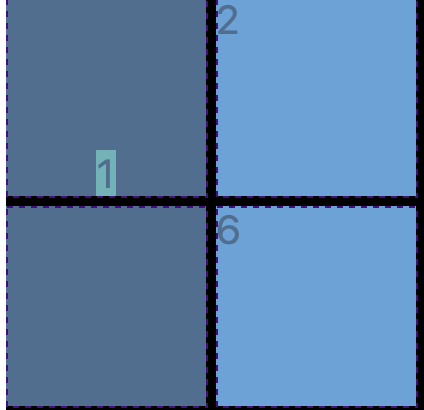
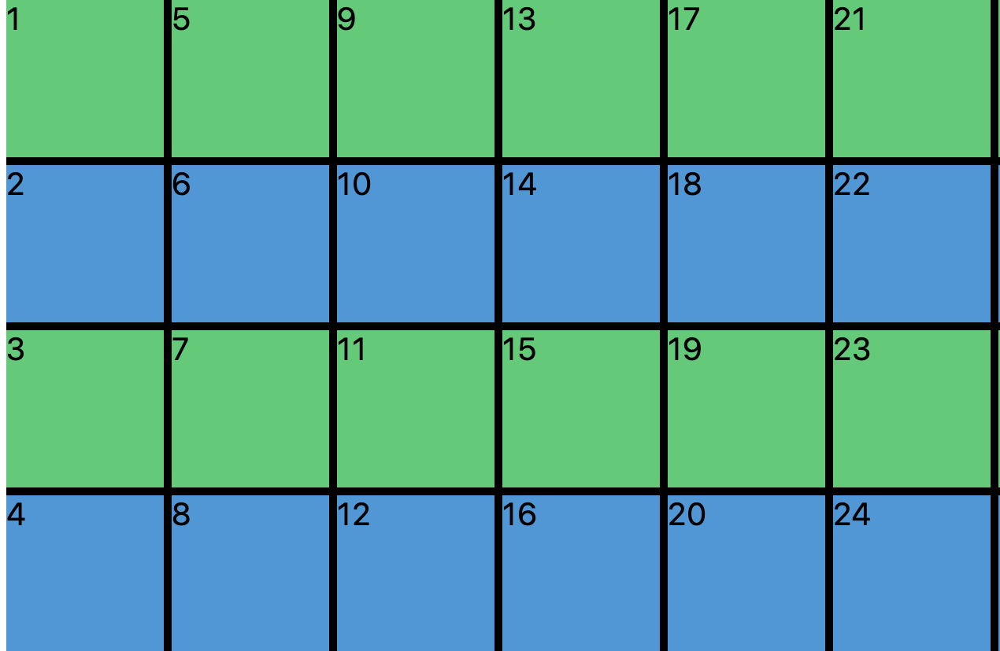
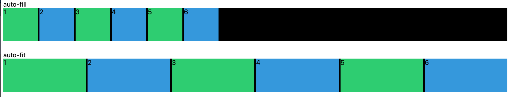

## Grid

## [🌱 Practice at Grid Garden 🌱](https://cssgridgarden.com/)

```css
.father {
  display: grid;
}
```

- Flex is only columns: one dimensional layout.
- Grid is two dimensional: you can create table-like grid layout
- usually talking to father, not to children

### [grid-template-columns, grid-template-rows](https://developer.mozilla.org/en-US/docs/Web/CSS/grid-template)

### grid column-gap, grid row-gap

```css
.grid {
  display: grid;
  grid-template-columns: 250px 250px 250px;
  grid-template-rows: 100px 50px 300px;
  column-gap: 5px;
  row-gap: 10px;
}
```

- gap between grids are written as column-gap, row-gap
- writing "gap" standalone is for both column-gap and row-gap

### grid-template-areas

```css
.grid {
  display: grid;
  grid-template-columns: repeat(4, 200px);
  grid-template-rows: 100px repeat(2, 200px) 100px;
  grid-template-areas:
    /* row names and aligning */
    "header header header header"
    "content content . nav"
    "content content . nav"
    "footer footer footer footer";
}

.header {
  background-color: gold;
  grid-area: header;
}

.content {
  background-color: greenyellow;
  grid-area: content;
}

.nav {
  background-color: orange;
  grid-area: nav;
}

.footer {
  background-color: purple;
  grid-area: footer;
}
```

- Matching grid-area value to grid-template-areas value in father. NOT BY CLASS NAMES!

### grid-column and grid-row

```css
.grid {
  display: grid;
  gap: 10px;
  grid-template-columns: repeat(4, 100px);
  grid-template-rows: repeat(4, 100px);
}

.header {
  background-color: gold;
  /* grid-column-start: 1;
  grid-column-end: 5;*/

  /* grid-column: 1 / 5; */

  grid-column: 1 / -1;
}

.content {
  background-color: greenyellow;
  /*grid-column-start: 1;
  grid-column-end: 4;
  grid-row-start: 2;
  grid-row-end: 4;*/

  /* grid-column: 1 / 4;
  grid-row: 2 / 4; */

  grid-column: 1 / -2;
  grid-row: 2 / span 2;
}

.nav {
  background-color: orange;
  /* grid-row-start: 2;
  grid-row-end: 4; */

  /* grid-row: 2 / 4; */

  grid-row: 2 / span 2;
}

.footer {
  background-color: purple;
  /* grid-column-start: 1;
  grid-column-end: 5; */

  /* grid-column: 1 / 5; */

  grid-column: span 4;
}
```


**Nominating & Stretching with # starting line and # end line**

- stretching elements from start (#white-line-number) to end (#white-line-number)
- abbreviaiton with (starting line) / (end line)
- you can count lines from beginning as 1, 2, 3 ...
  - left border line is 1: start line
- you can count from the end as -1, -2, -3 ...
  - right border line is -1: end line

**Stretching with numbers of cells**

- stretching elements with span (space numbers)
- you can mix with starting line and end line

### **fr(fraction)**

```css
.grid {
  display: grid;
  width: 500px;
  height: 50vh;
  grid-template-columns: 1fr, 1fr, 1fr, 1fr;
}
```

- **Takes in from the size of the grid itself: width and height**
- Sizing columns as 100 px will be too big on phone
- **fr and % are both proportional to window size**

### grid-template and fr

```css
.grid {
  display: grid;
  gap: 10px;
  width: 100wh;
  height: 100vh;
  grid-template:
    /* naming each of cells */
    "header header header header" 1fr /* 1fr is how tall the cells are */
    "content content content nav" 2fr
    "footer footer footer footer" 1fr / 1fr 1fr 1fr 1fr;
  /* width of cells in each 4 rows*/
  /* 4 rows: 1fr + 2fr + 1fr */
}

.header {
  background-color: gold;
  grid-area: header;
}

.content {
  background-color: greenyellow;
  grid-area: content;
}

.nav {
  background-color: orange;
  grid-area: nav;
}

.footer {
  background-color: purple;
  grid-area: footer;
}
```

### justify-items & align-items: moving contents within grid


```css
.grid {
  display: grid;
  align-items: end;
  justify-items: stretch;
}
```

- In html, needs to have some contents(like letters) to move items within cell along axis
  - main axis is fixed as x-axis, cross axis is fixed as y-axis
  - justify-content is horizontal, align-items is vertical
- default value is stretch: stretching along the axis

### place-items

```css
.grid {
  display: grid;
  place-items: end stretch;
}
```

- Shortcut for align-items and justify-contents

### justify-content & align-content Moving grids as a whole

```css
.grid {
  background: black;
  display: grid;
  gap: 10px;
  height: 250vh;
  grid-template-columns: repeat(4, 100px);
  grid-template-rows: repeat(4, 100px);
  align-content: end;
  justify-content: space-evenly;
}
```


- Grid container is 100% width, which is black background on the note_img/image
- justify-content and align-content moves **whole grid** within grid container.
- It is different from justify-items and align-items, since
  -items **only move contents within individual grids.**

### place-content

```css
.grid {
  background: black;
  display: grid;
  gap: 10px;
  height: 250vh;
  grid-template-columns: repeat(4, 100px);
  grid-template-rows: repeat(4, 100px);
  /* align-content: end;
  justify-content: space-evenly; */
  place-content: end space-evenly;
}
```

- shortcut for align-content & justify-content

### align-self, justify-self, place-self



```css
.item:nth-child(odd) {
  background-color: #2ecc71;
  align-self: end;
  justify-self: center;
  /* place-self: end center */
}
```

- applying only to child grid itself and content within

### grid-auto-rows


```css
.grid {
  background: black;
  display: grid;
  gap: 5px;
  grid-template-columns: repeat(4, 100px);
  /* grid-template-rows: repeat(4, 100px); */
  grid-auto-rows: 100px;
}
```

- You don't know how much rows of grids you should prepare in order to hold data from the server
- if content numbers >>> rows, then disaster!
- So automatically prepare rows

### grid-auto-flow


```css
.grid {
  background: black;
  display: grid;
  gap: 5px;
  grid-template-columns: repeat(4, 100px);
  grid-template-rows: repeat(4, 100px);
  grid-auto-flow: column;
}
```

- whenever more divs in html than prepared in css, you can place overflowed item to row / column direction
  - column is horizontally arraying direction -> gallery of photos
  - row is vertically arraying direction -> usually used

### grid-auto-columns



```css
.grid {
  ... grid-auto-flow: column;
  grid-auto-columns: 100px;
}
```

- Used along with grid-auto-flow, keeping size still for overflowed arrayed elements

### minmax

```css
.grid {
  display: grid;
  grid-template-columns: repeat(10, minmax(100px, 1fr));
```

- setting minimum / maximum size for the grid
- minimum size can be absolute
- maximum size can be both absolute or relative

## Responsive Design

### grid-auto-fill


```css
.grid {
  background: black;
  display: grid;
  gap: 5px;
}

.grid:first-child {
  grid-template-columns: repeat(auto-fill, minmax(100px, 1fr));
}
```

- automatically filling empty spaces with more numbers of grids
- when receiving numbers of elements are undefined, you can use grid-auto-fill

### grid-auto-fit




```css
.grid {
  background: black;
  display: grid;
  gap: 5px;
  /* first picture is grid-auto-rows where two rows are automatically formed */
  grid-auto-rows: 100px;
}

.grid:last-child {
  grid-template-columns: repeat(auto-fit, minmax(100px, 1fr));
}
```

- automatically stretching grids to the empty spaces in windows

### min-content

```css
.grid {
  display: grid;
  grid-template-columns: repeat(5, minmax(min-content, 1fr));
  grid-auto-rows: 100px;
}
```

### max-content

```css
.grid {
  display: grid;
  grid-template-columns: repeat(auto-fit, minmax(20px, max-content));
  grid-auto-rows: 100px;
}
```

## 